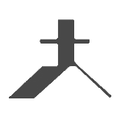
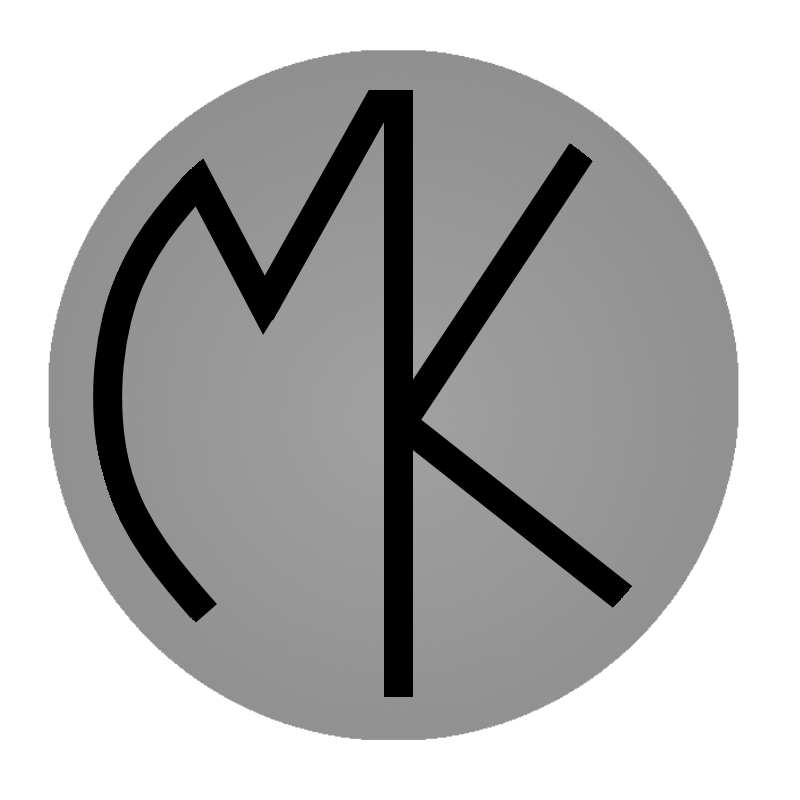

<!--css for animated business icons-->
.lollipack{
  position: relative;
  width: 300px;
  height: 150px;
  margin: 0 auto;
  overflow: hidden;
}
.lollistick{
  width:50px;
  height:75px;
  -webkit-transform-origin: 25px 75px;
  -ms-transform-origin: 25px 75px;
  -moz-transform-origin: 25px 75px;
  -o-transform-origin: 25px 75px;
  transform-origin: 25px 75px;
  -webkit-transform: translateX(50px);
  -ms-transform: translateX(50px);
  -moz-transform: translateX(50px);
  -o-transform: translateX(50px);
  transform: translateX(50px);
  position: absolute;
  -webkit-animation: lollistick 4.5s linear 0s infinite normal forwards running;
  -moz-animation: lollistick 4.5s linear 0s infinite normal forwards running;
  -o-animation: lollistick 4.5s linear 0s infinite normal forwards running;
  animation: lollistick 4.5s linear 0s infinite normal forwards running;
}
.lollitop{
  -webkit-transform-origin: center;
  -ms-transform-origin: center;
  -moz-transform-origin: center;
  -o-transform-origin: center;
  transform-origin: center;
  -webkit-animation: lollitop 4.5s linear 0s infinite normal forwards running;
  -moz-animation: lollitop 4.5s linear 0s infinite normal forwards running;
  -o-animation: lollitop 4.5s linear 0s infinite normal forwards running;
  animation: lollitop 4.5s linear 0s infinite normal forwards running;
}
@-webkit-keyframes lollistick {
  0%{-webkit-transform: translateX(50px)}
  25.58%{-webkit-transform: translateX(200px)}
  50%{-webkit-transform: translateX(200px) rotate(180deg)}
  74.42%{-webkit-transform: translateX(50px) rotate(180deg)}
  100%{-webkit-transform: translateX(50px) rotate(360deg)}
}
@-moz-keyframes lollistick {
  0%{-moz-transform: translateX(50px)}
  25.58%{-moz-transform: translateX(200px)}
  50%{-moz-transform: translateX(200px) rotate(180deg)}
  74.42%{-moz-transform: translateX(50px) rotate(180deg)}
  100%{-moz-transform: translateX(50px) rotate(360deg)}
}
@-o-keyframes lollistick {
  0%{-o-transform: translateX(50px)}
  25.58%{-o-transform: translateX(200px)}
  50%{-o-transform: translateX(200px) rotate(180deg)}
  74.42%{-o-transform: translateX(50px) rotate(180deg)}
  100%{-o-transform: translateX(50px) rotate(360deg)}
}
@keyframes lollistick {
  0%{transform: translateX(50px)}
  25.58%{transform: translateX(200px)}
  50%{transform: translateX(200px) rotate(180deg)}
  74.42%{transform: translateX(50px) rotate(180deg)}
  100%{transform: translateX(50px) rotate(360deg)}
}
@-webkit-keyframes lollitop {
  0%{-webkit-transform: initial}
  25.58%{-webkit-transform: initial}
  50%{-webkit-transform: rotate(-180deg)}
  74.42%{-webkit-transform: rotate(-180deg)}
  100%{-webkit-transform: rotate(-360deg)}
}
@-moz-keyframes lollitop {
  0%{-moz-transform: initial}
  25.58%{-moz-transform: initial}
  50%{-moz-transform: rotate(-180deg)}
  74.42%{-moz-transform: rotate(-180deg)}
  100%{-moz-transform: rotate(-360deg)}
}
@-o-keyframes lollitop {
  0%{-o-transform: initial}
  25.58%{-o-transform: initial}
  50%{-o-transform: rotate(-180deg)}
  74.42%{-o-transform: rotate(-180deg)}
  100%{-o-transform: rotate(-360deg)}
}
@keyframes lollitop {
  0%{transform: initial}
  25.58%{transform: initial}
  50%{transform: rotate(-180deg)}
  74.42%{transform: rotate(-180deg)}
  100%{transform: rotate(-360deg)}
}
<!--extra html for animated businesses-->

  <h1>
    Commercial tenants
  </h1>
  

    

    

    

    

    

    

    

    

    

  

